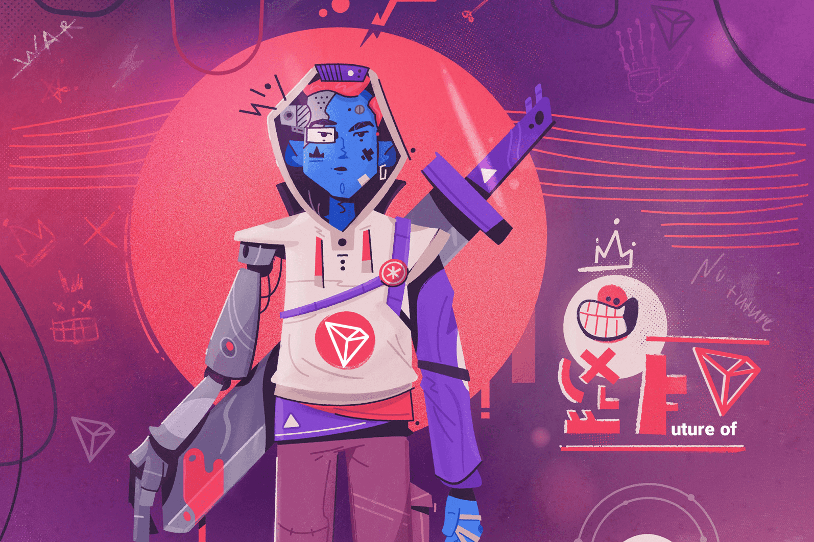

# Future of TRON

Future of TRON 是一个基于智能合约技术的投资平台。每天从您的总投资中赚取 5-8.3%。推荐：L1：5% / L2：3% / L3：1%。于 2020 年 12 月 3 日推出。

它的 TRX 价格预测继续乐观，2026 年平均为 0.43 美元，2027 年平均为 0.64 美元，2028 年为 0.94 美元，2029 年为 1.40 美元。该网站对 2030 年的 TRON 价格预测认为它会飙升至 1.97 美元，然后在 2031 年达到平均 2.86 美元。

TRON 的工作方式与以太坊类似，因为区块链网络托管 dApp（去中心化应用程序），因此创作者可以选择避免与亚马逊和谷歌等科技巨头合作。

与率先使用智能合约的以太坊等其他项目一样，TRON 铸造了一枚硬币，以使其用户能够交易并为其内容支付托管费用。 TRON 加密货币也可以用作价值存储，可以购买、出售或交换。

该网络取得了一些显着的商业成功，接管了文件共享网络 BitTorrent，并在 2019 年签署了将 TRON 的区块链与三星区块链密钥库集成的协议。

2021 年 12 月，当 Sun 被任命为加勒比岛国格林纳达世界贸易组织的代表时，TRON 又回到了新闻中。

但这并不意味着 TRX 代币会消失。相反，TRON 的未来现在主要掌握在其用户和投资者手中。

