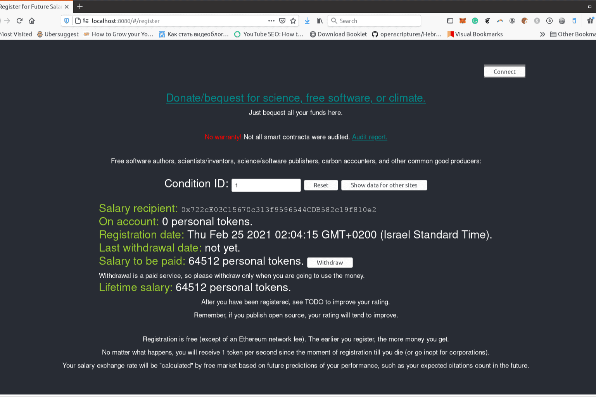

# Future Salaries

相当于从未来转移资金的数学运算用于根据市场预测的未来软件评估的未来表现，向科学家、自由软件作者或碳会计等公益生产者支付“工资”。我们在经济上刺激搜索引擎所有者根据未来的表现为我们计算工资。共同利益 = 未来，因此从未来转移工资是最公平的分配资金方式。

Future 的平均年薪为 48,958 美元，即每小时 23.54 美元。 Future 每年向底层 10% 的人支付 21,000 美元，而前 10% 的人则支付超过 109,000 美元。未来从事不同工作的员工获得不同的薪水。在企业管理工作中，员工的平均工资为 122,599 美元。

