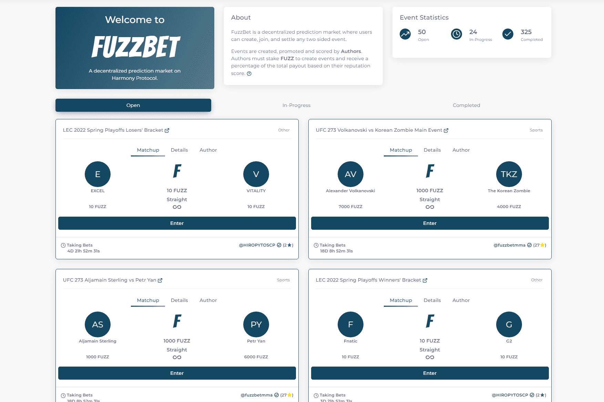

# FuzzBet

FuzzBet 是一个去中心化的预测市场，用户可以在其中创建、加入和解决任何双边事件。
活动由作者创建、推广和评分。作者必须质押 FUZZ 来创建活动并根据他们的声誉得分获得总支出的一定百分比。

FuzzBet 是一个去中心化的体育博彩，它允许用户创建作者简介、部署任何双边赛事并根据您的作者声誉得分获得高达 10% 的总底池佣金。作者应创建和推广自己的赛事，创建自己的独特投注道具社区。参赛者没有KYC，任何人都可以来参与其中！

我们目前正在 Harmony 测试网上完成我们投注平台的最新迭代，现在处于测试的最后阶段，如果您想测试它，请前往

