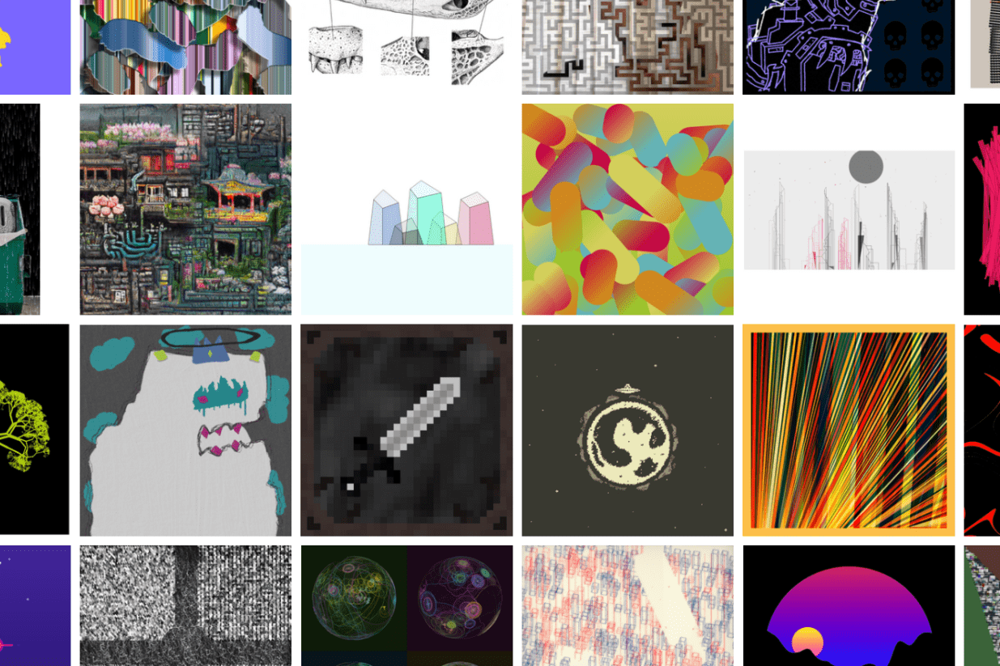

# fxhash

fxhash 是一个开放平台，艺术家可以在其中铸造存储在 Tezos 区块链上的生成代币。 fxhash 是一个开放平台，没有自上而下的管理。艺术家可以自由上传他们认为有价值的生成艺术作品。策展只通过社区完成。,艺术家

“块”的每个变体都是不同的。这些块是随机放置的，这会导致每个薄荷的声音完全不同的循环。选择随机调色板以及不同的块形状、声音、边框、背景和其他随机特征。这一切都经过精心设计，希望所有变化都会受到喜爱。

