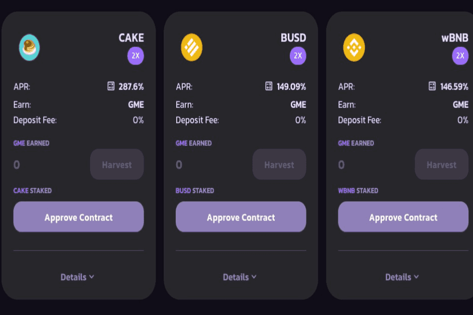

# GameTokenFinance

币安智能链上的收益平台，坚持加密世界的游戏玩家。项目分为gametoken和gamemarket两部分。 Gametoken 是项目的原生代币，人们可以通过网站的收益农场页面进行投资和获利，让人们要么成为纯粹的投资者以获取利润，要么在以后为游戏市场收集更多的 GME。 Gamemarket 是出售游戏 CD 密钥的地方，只接受 GME，这让人们有机会花费他们赚取的 GME 在他们想要的任何平台上购买任何游戏，从而为代币本身创建一个用例。

