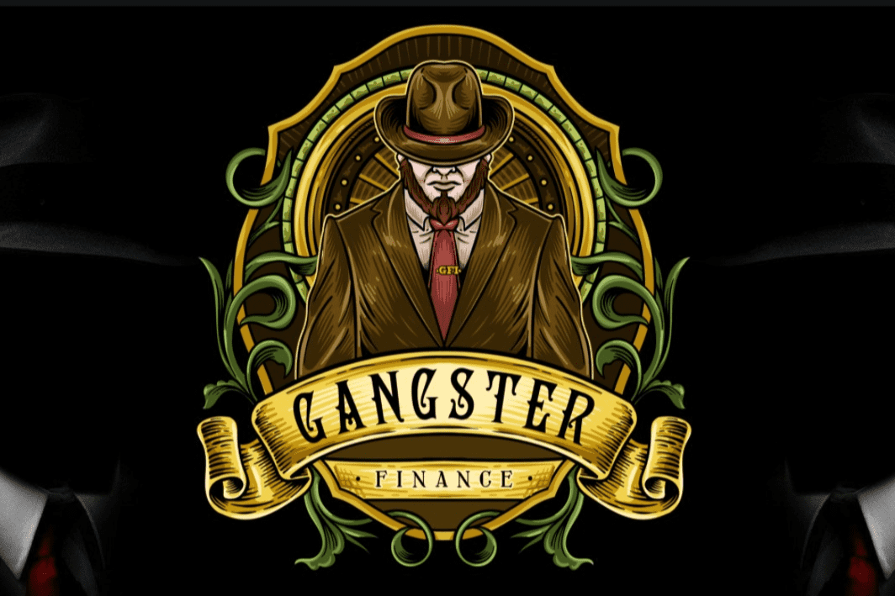

# Gangster Finance

黑帮金融
于 2021 年 4 月在币安智能链上推出，旨在创建一个去中心化金融智能合约平台，为用户带来值得信赖的高收益储蓄工具。厌倦了拉扯、不合标准的项目和不道德的开发商，Gangster Finance 的成立旨在为投资和 dapp 开发提供安全的空间。
在撰写本文时，有 12 个储蓄金库具有即时红利和每日滴水功能，这些功能旨在通过每次用户交互来维持生态系统。
请阅读我们的文档，其中包含有关我们的储蓄金库和项目的详细信息。
GFI 代币
GFI 代币基于 Rootkit 开发团队和 ProfKronos 创建的 ERC-31337 标准。 GFI 于 2021 年 9 月 24 日推出，利用“可重复使用的锁定流动性”。这是一个独特的概念，展示了巨大的潜力，特别是在构建更大的 Dapp/合约生态系统方面。 ERC-31337 模型具有原生的费用共享特性，这使其非常适合开发团队/项目以有吸引力和潜在的激励方式进行构建。
GFI 于 2021 年 9 月 24 日在 ShibaNova DEX 上市。
此外，GFI 在 Gangster Finance dapp 上的 xGFI 的质押也开始了

