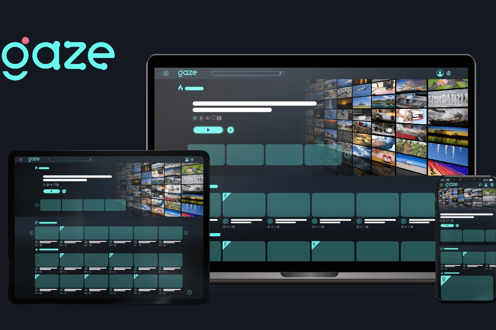

# GazeTV

GazeTV 是一个分散的区块链驱动的社交娱乐平台，具有内置的激励和奖励功能。 GAZE 代币化生态系统旨在使创作者能够定制他们的内容并因其工作而获得奖励，而观众则可以奖励创作者并以全新的方式参与视频内容。 GazeTV 利用区块链基础和 GAZE 代币来应对这一挑战，让用户根据自己的喜好和品味补偿创作者。创作者可以通过赚取、质押和交换 GAZE 代币来跟踪奖励和收视率，从而加快内容收入的分配。 GazeTV 将“用户”转变为一个全球参与的社区。该平台还为创作者提供了自动内容同步功能，可以快速轻松地将他们的内容从其他平台带到他们的 GazeTV 频道。创作者可以从 Youtube、Facebook 和超过 4.55 亿个 WordPress 网站无缝同步他们的内容。

