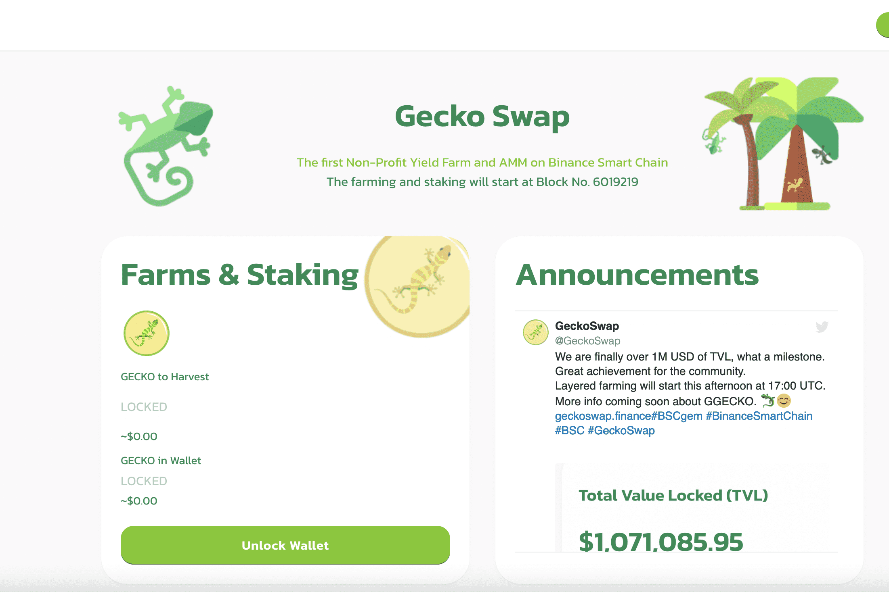

# Gecko Swap

GeckoSwap 是一个完全去中心化的交易所和收益农场。不会有 GECKO 的预售或早期持有者。实施公平启动，为所有投资者提供公平的加入机会。 GeckoSwap 选择了最重要的代币经济学元素，包括通货紧缩代币，以创建可持续的生态系统和农业体验。确保在奖励、代币实用性和新开发之间保持平衡是 GeckoSwap 的首要任务。
以下是一些已经实施的重要功能：GECKO 农场和游泳池、审计、热带回购、热带税收、分层农业、移除迁移代码、时间锁定（在发布时添加）。

