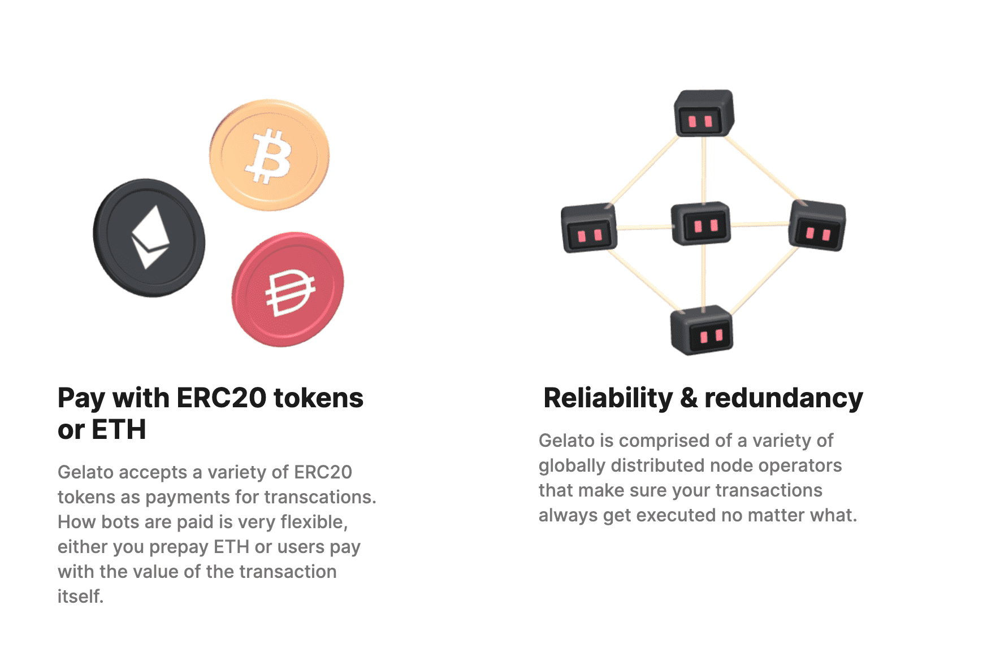

# Gelato Network

Gelato 是一种在以太坊上自动执行智能合约的协议。我们正在以太坊之上构建可靠自动化的基础设施，并以此作为 Web3 中间件堆栈的关键部分，实现所有智能合约和即将到来的第 2 层网络之间的无信任、自动化资金流动。此外，我们在 Uniswap 上构建了 Sorbet Finance、Limit Orders。

使用 ERC20 代币或 ETH 支付
Gelato 接受各种 ERC20 代币作为交易付款。机器人的支付方式非常灵活，您可以预付 ETH 或用户使用交易本身的价值进行支付。

可靠性和冗余
Gelato 由各种全球分布的节点运营商组成，可确保您的交易始终得到执行。

自动化任意智能合约逻辑
Gelato 可以执行任意逻辑，使您能够自动化以太坊上的任何智能合约功能。潜在的用例是无穷无尽的。

