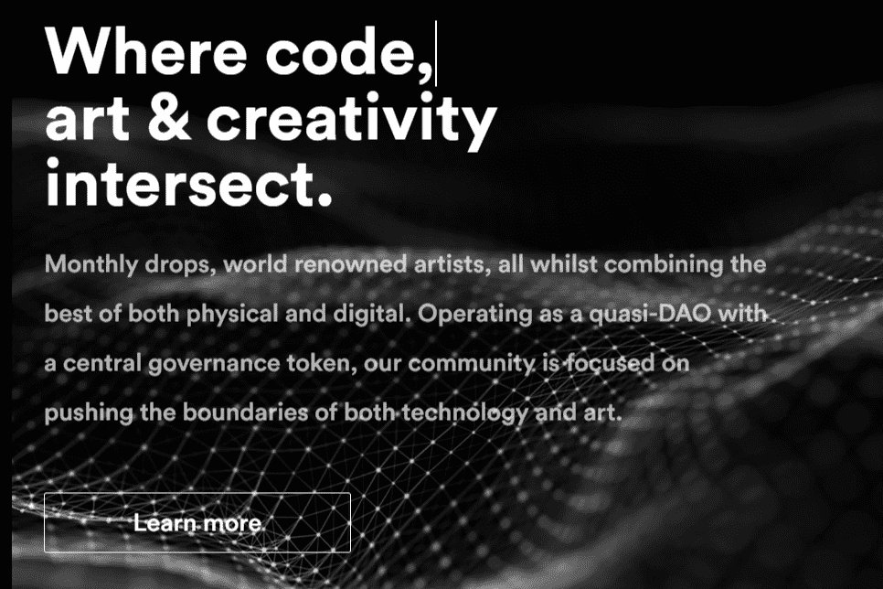

# GEN.ART

作为GEN.ART的成员，您将能够铸造世界著名艺术家的独家NFT（ERC-721）艺术品。我们将会员限制在5100人。作为终身会员，您不仅是收藏家和艺术家特殊群体的一员，还将通过空投的治理令牌（ERC-20）对GEN.ART的未来拥有积极的发言权。人工智能（AI）不仅影响着商业和医疗等行业。通过开创人工智能生成艺术的新时代，它还在创意产业中发挥着越来越大的作用。任何人都可以广泛使用人工智能技术和工具，这有助于创造全新一代的艺术家。
我们经常听说人工智能将自动化或接管所有人类任务，包括艺术、电影和其他创意行业的任务。但事实远非如此。人工智能是一种补充工具，艺术家可以使用它来探索新的创作领域。
任何人都可以使用这些创造性的人工智能工具来创作艺术，而艺术通常可以转化为NFT。

