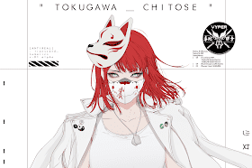

# GENE_SIS

有人可能还没有意识到…但我们都是战士_ SENSHIs在为自己战斗。
Web3.0、metaverse、区块链……随你怎么说，技术只是连接我们所有人的工具。呼吁所有的感官_无论你是谁，你可能住在哪里，你可能喜欢什么，加入我们。“基金会对我来说意义重大。我在FND上开始了我的NFT艺术家生涯，它给了我一个机会，让我在创作我想创作的作品时认识每个人。

我想在这里与大家一起开始GENE_ SIS的伟大开端。”-加利埃拉

时间：美国东部时间2022年2月23日12:00

上市价格：0.5 ETH

所有投标人将获得1份投标名单（多次投标仅授予您1份）

获胜者将获得一枚免费铸币，相当于总出价除以10，四舍五入。

获胜者将能够参与GENE_。

只要艺术品未转移或出售给其他钱包，将授予中标特权。

