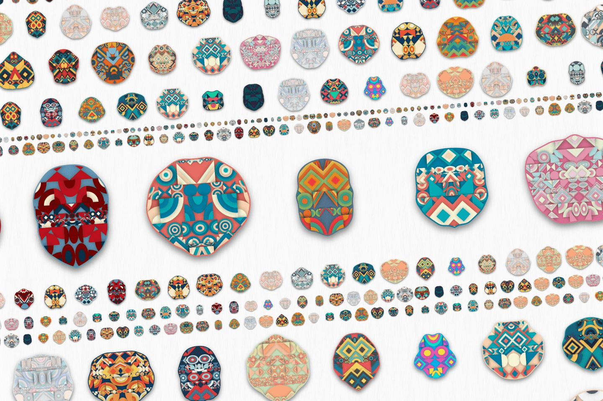

# Generative Masks

Generativemasks是使用Generative art创建的10000个独特的NFT艺术。该NFT自动一个接一个地“生成”具有不同表情的独特面具，每次在NFT市场上重新加载时，您都可以享受不同颜色的面具。
这项工作的灵感来自于发现对称排列的几何图案中的生命感。我试图用意想不到的形状和图案来表达美国土著图腾柱和日本土著横井令人恐惧但却有点迷人的气氛。Generativemasks是使用Generative art创建的10000个独特的NFT艺术。该NFT自动逐个生成具有不同表达的独特面具。

