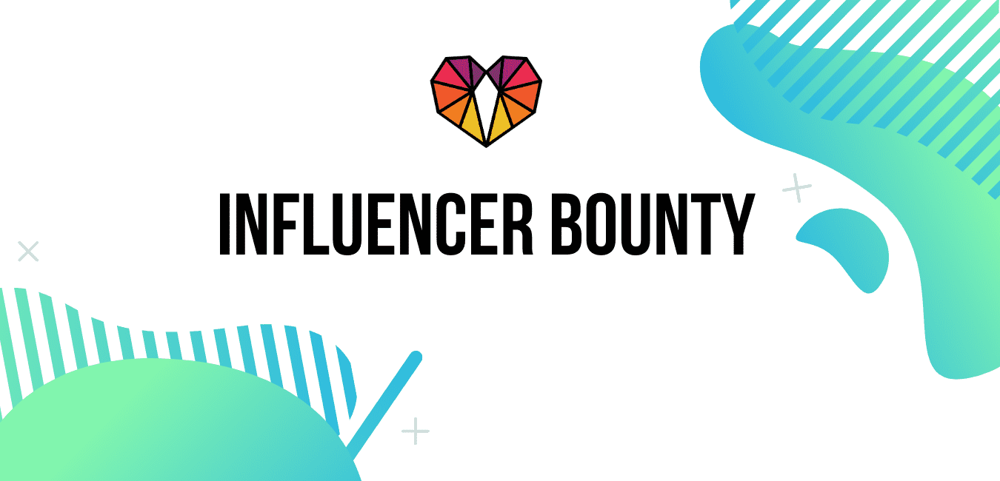

# GenPool.io

首次EOS投票奖励交换。赚取被动收入，同时支持网络增长，使您的代币价值最大化。EOS投资者的最佳选择。1.EOS 是委托权益证明 (DPoS) 系统，它使用户能够投票支持区块生产者来验证区块和运营网络。 投票最多的区块生产者从每年 1% 的区块奖励和投票奖励中的代币通胀中获得服务报酬。EOS 账户必须将其 EOS 质押到 CPU/NET 或购买 REX 才能投票给区块生产者。每个EOS账户只能投票给30个超级节点。 每个区块生产者获得相同的投票权重。 例如，如果你有 1000 个 EOS，则 30 个投票的区块生产者中的每一个都将获得 1000 个 EOS 投票权重分配给他们。您可以将您的投票委托给代理或在我们的情况下为奖励代理，而不是投票给单个区块生产者。

