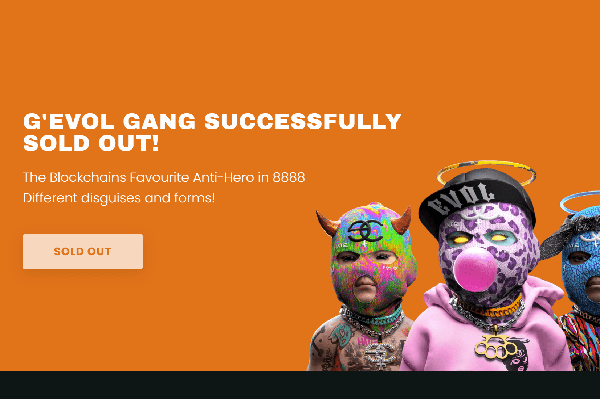

# GEVOLs

谁是 EVOL？ 眼镜
EVOL，一个拥有 2000 年历史的小天使，在与管理层发生分歧后被打倒在地。 起初太骄傲而不敢尝试回家，现在，他不记得他必须做什么才能到那里。
经过几个世纪同样好的和坏的行为之后，他在区块链上找到了家。 G'EVOLs 是 EVOL 在任何一天都可以采取的 8888 种伪装和形式的集合。
每个 G'EVOL 都是从 150 多个特征中随机生成的。 每一个都是独一无二的，很容易偷走你的女孩。
G'EVOLs 有一些不同于您之前可能见过的其他 Generative 系列的特点 - 新鲜、大胆和多彩 - 一种思考什么是 Generator 系列的新方式。

