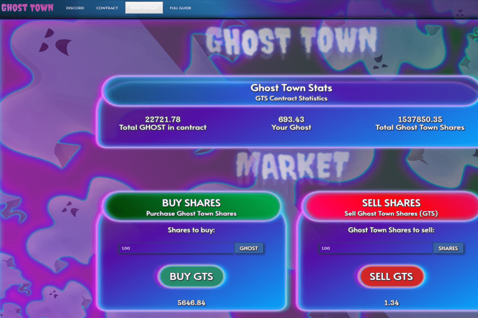

# Ghost Town

使用 GHOST ERC20 代币的去中心化 GHOST 主节点质押模拟器游戏。 包括在 GHOST 发布前一天结束的自动抽奖活动！鬼城或废弃的城市或废弃的城市是废弃的村庄、城镇或城市，通常包含大量可见的剩余建筑物和道路等基础设施。一个城镇经常成为鬼城，因为支撑它的经济活动（通常是工业或农业）因任何原因（例如金属开采耗尽的主矿床）失败或结束。由于洪水、长期干旱、极热或极冷、政府行为、无法控制的无法无天、战争、污染或核灾难等自然或人为灾害，该镇也可能衰落。这个词有时可以指城市、城镇和社区，尽管仍然有人居住，但比过去几年要少得多；例如，那些受高失业率和失职影响的人。 [1]

一些鬼城，特别是那些保留了特定时期建筑的鬼城，已成为旅游景点。例如美国蒙大拿州的班纳克、加拿大不列颠哥伦比亚省的巴克维尔、意大利的克拉科、阿塞拜疆的阿格达姆、纳米比亚的科尔曼斯科普、乌克兰的普里皮亚季、印度的达努什科迪和巴西的福特兰迪亚。

位于加勒比海蒙特塞拉特岛的普利茅斯镇是一个鬼城，是蒙特塞拉特的法定首都。 1995 年苏弗里耶尔山火山喷发造成的火山灰使其无法居住，并且一直如此。

