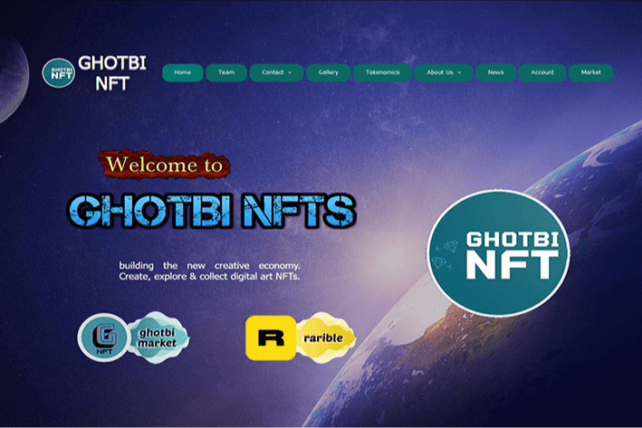

# ghotbi nft

ghotbi NFT 是物理世界和数字世界之间的桥梁。它是一种现象，可以以虚拟格式收集世界艺术家的作品，艺术家可以与他人分享他们的作品并赚钱，除了了解世界各地独特的 ٫ pure 和几件艺术品。 Ghotbinft 格式艺术品产品业务的优势： 1. 了解由独特创新和创造力产生的各种不同人的艺术品 2. 开发安全和合适的艺术品交易平台。艺术品和 Nft 财产不存在清算或破坏风险，并且交易进行得很清楚。 3. 由于产品的特殊标准，并由相关专家对它们进行评级（根据标准和标准），艺术品也将获得非物质价值我们帮助您在 Ghotbinft 获得丰厚的收益，轻松出售/购买您/他人的艺术品通过数字技术为您提供的能力安全地想象。如果您觉得在金融市场和代币中获得收益滞后，或者您想在 Nft(s) 中获得新体验并且没有虚拟篮子，Ghotbinft 是这个范围内最安全和最好的机会，所以不要忽视！ GhotbiNft 已准备好与世界各地的所有艺术家、收藏家和爱好者合作。我们就是未来！！

