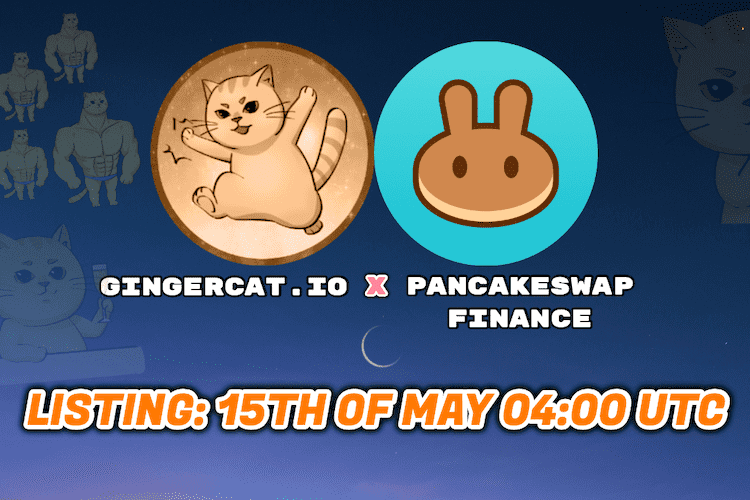

# GingerCat

GingerCat是猫社区联合发行的DeFi概念猫灵项目。这个想法是与地球上的每个人分享猫。分享可爱，关怀和乐趣，没有私募，没有众筹。团队成员还全天候开发量子级（超光速）移动报价应用程序。总量 9.99 亿枚代币也将每季度被黑洞销毁，直至销毁 99% 的数量。
GingerCat 社区发行的代币 GCAT 将创造九位数的总供应量，寓意“一只猫有九条命”（当然，猫在现实生活中也很容易受伤）。经过热烈讨论，一致同意将最终流通量锁定为9,999,999，GingerCat代币正式诞生！
代币经济学：
总供应量：999,999,999
流通供应：9,999,999
-团队：1,000,000
-空投：500,000
-开发：500,000
-流动性：7,999,999
代币销毁：GCAT 销毁活动计划每季度进行一次，直到最终销毁 990,000,000 GCAT，占曾经发行的 GCAT 总量（999,999,999 GCAT）的 99%。
一旦每季度进行一次代币销毁，团队就会发布官方公告，说明已销毁的 GCAT 代币数量。您可以在 Bscscan 等 Binance Smart Chain Explorer 上验证所有 GCAT BEP-20 Coin Burn 交易。燃烧的交易是公开的、不可逆转的并永久记录在区块链上。
GingerCat开发：团队正在开发一款量子超光速手机报价APP，预计2021年6-7月上线。

