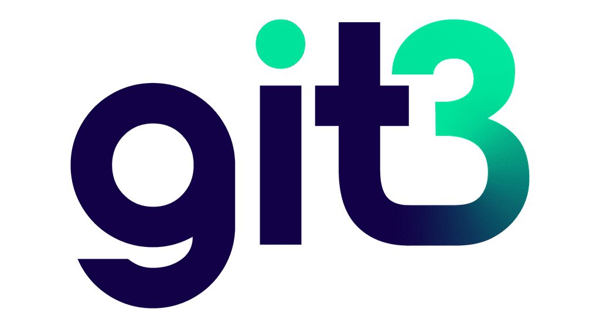

# Git3

你可能会问为什么拥有一个去中心化的 GitHub 很重要。 如果您最近关注新闻，您可能会遇到 youtube-dl 库被删除的情况。 使用去中心化的 GitHub，删除变得非常困难！ 你有没有想过让回购的维护者/所有者花一点钱买咖啡/啤酒？ 目前这很困难。 已经内置了这个功能不是很好吗？ 只需单击一下即可为您最喜欢的存储库留下提示。

2020 年 10 月，我参加了 EthOnline 黑客马拉松，我在其中开发了一个去中心化的 Github 版本。在黑客马拉松期间，我创建了一个简单的 PoC，展示了 Git 存储库可以由智能合约表示，并且文件/对象可以存储在 IPFS 上。我收到了对我的项目表现出兴趣的人的消息。因此，我决定继续从事这个项目。

那么，目前的阶段是什么？我能够发布第一个 alpha 版本，是的。我花了一些时间才到这里，因为必须重写智能合约，部署在 Polygon 上，并且必须修复 git3 客户端。但是，通过本文，我想为您提供有关如何使用 Git3 客户端、创建存储库以及如何推送内容的分步指南。

请记住，这是一个 alpha 阶段并且包含错误！智能合约部署在 Polygon 测试网上，因此可以根据需要进行测试。

我在终端中使用 Python3.8 在 macOS Big Sur 版本 11.2.3 上测试了代码。如果您在不同的操作系统上测试它，请告诉我，因为我没有机会在不同的操作系统上测试它。

事不宜迟，让我们开始吧

