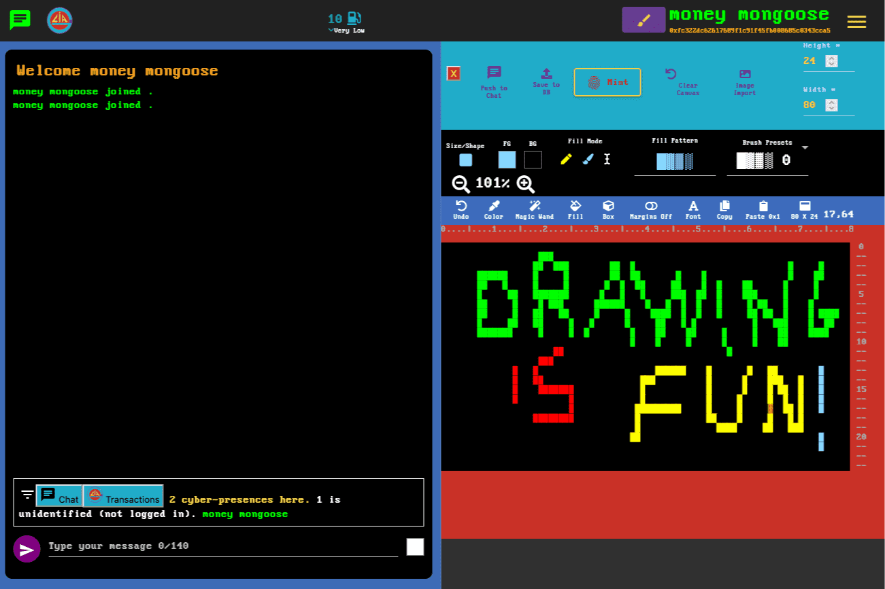

# glia.icu

自2018年以来，GLIA代币完全生活在分类账上的ETH区块链上
访问我们的DAPP，在我们的自定义编辑器/导入器中创建您自己的令牌和/或与其他用户闲聊。
查看我们的YouTube教程和预览
没有两个令牌可以是相同的，在链上进行哈希和验证-mint的成本比大多数NFT都高！
256色ANSI/文字艺术，具有20世纪80年代的历史价值，无需软盘-数据存储在链上！
令牌可以完全解码（开源和发布）并从区块链呈现。艺术在计算机终端中也可以被视为存储在链上的文本，而不是像许多NFT一样存储在文件系统上的图像。
除非ETH停止存在，否则不会停止存在。审查是抵制的。
令牌具有基于权限的神经网络元属性链接结构：这让你可以用它们做一些很酷的事情！

