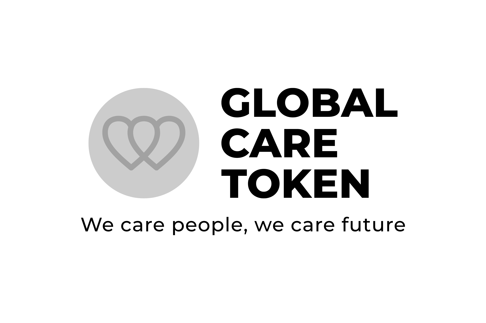

# GLOBAL CARE TOKEN

全球关爱代币旨在关爱人们和未来。
它被定义为非政府组织令牌，因为它旨在成为一个将非政府组织（非政府组织）和非政府发展组织（NGOD）聚集在一起的网络。将国家、国际和地方各个领域的组织聚集在一起的网络；我们支持他们的活动和行动。
我们通过业主选择的行动来照顾处境最不利的人。
我们通过静态奖励来照顾我们的员工（肩膀）。
我们关心未来，通过生态行动，减少二氧化碳足迹，等等。
全球护理代币（GLCare）通过其智能合约中编码的交易费用支持人员任务的开发和运行。
目前，该合同采用：静态奖励、慈善、流动性池供应和营销/开发。当前交易税总额为12%，详见以下章节。
Global Care通过减少代币的总供应来鼓励持有，同时通过开发高功能和激励性捐赠以及建立伙伴关系来促进更大的分销，从而增加对实用代币的需求。

