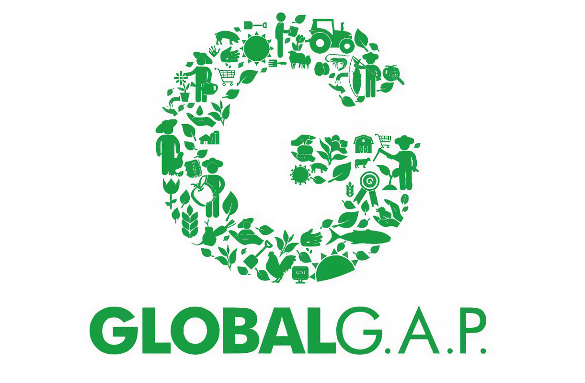

# GlobalDapp

自主独立应用程序（Dapp）构建在Tron平台上GlobalDapp是构建在Tron区块链上的独立应用程序。该平台是分散和透明的。您可以自己轻松地检查源代码。GlobalDapp dApp是基于Tron协议构建的高风险类别的加密资产。现在，根据用户数量，它在dApp总体排名中排名第5876位，在高风险类别中排名第197位，这让你很好地了解了GlobalApp dApp在竞争对手中的表现。
通过分析过去30天窗口内的GlobalDapp dApp数据，很明显，dApp余额为0.00美元，交易量稳定在0.00元。GlobalDapp在30天内生成了0笔交易，变化率为0%。显然，与前7天相比，交易量稳定了0%。过去7天的数据显示，GlobalDapp的用户基数为0，并且已经稳定了0%。
我们还建议查看GlobalApp活动概述和智能合约平衡图，以了解这些重要指标如何随时间波动和变化。

