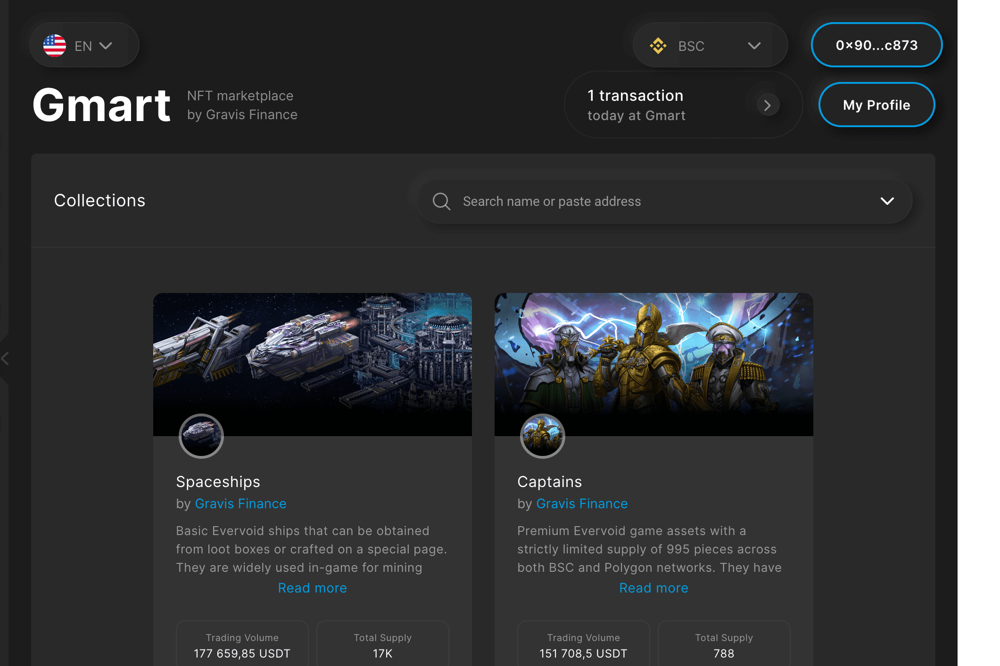

# Gmart by Gravis Finance

Gmart 是一个 NFT 市场，是 Gravis Finance 生态系统的一部分。 Gravis Finance 是一个将 DeFi 平台、游戏内资产的 NFT 市场和 Evervoid 游戏结合在一起的生态系统。 我们提供所有必要的工具来管理您在任何链上的加密资产。Gmart 的用户可以交易 Evervoid NFT 收藏品以及我们合作伙伴的 NFT。我们目前支持两个区块链：BSC 和 Polygon。 雪崩和索拉纳也将很快提供。NFT代表加密货币区块链上的记录，可以数位。

NFT 可以在前几年问世，不可以只拥有一个链接到收藏品，到、影片或程序。NFT 的推广认为，NFT 可以解决一个问题。

