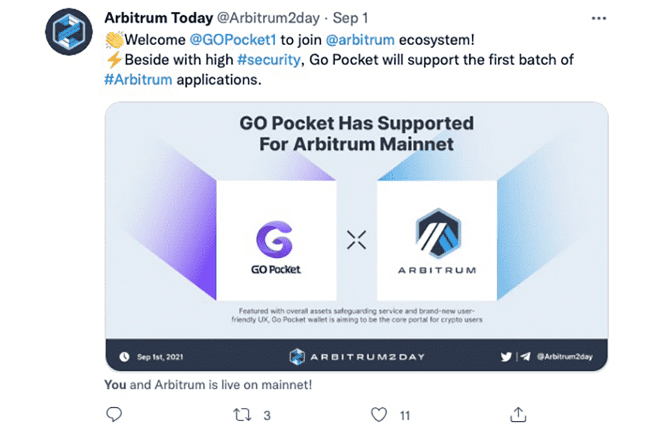

# Go Pocket

Go Pocket钱包以整体资产保护服务和全新的用户友好用户体验为特色，旨在成为加密用户的核心门户。它还有一个坚实的路线图，可以为社区治理开发一个去中心化的开放安全生态系统。
Go Pocket 为广大加密用户提供安全保障服务的关键是通过不断自我迭代的安全引擎和完善的安全响应机制，及时切断风险与用户之间的联系，增强用户的安全意识，让用户的风险在数字货币和区块链应用的使用量大幅减少。
换句话说，Go Pocket 提供的安全服务的核心理念不是阻止或阻止黑客和恶意项目的攻击，而是在阻止这些面向用户的安全攻击时，尽量减少响应时间，增加成本，降低利润，从而减少了区块链网络中安全威胁对用户的影响，保障了用户的资产安全。

