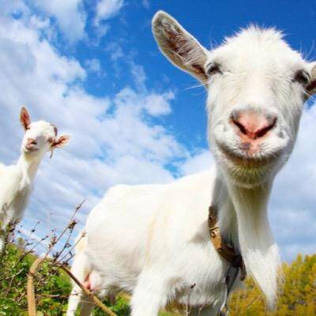

# GOAT

唯一适用于GOAT Finance的功能实用代币将作为在游戏中进行兑换的媒介和主要价值衡量标准。引入GOAT应用程序来衡量和交易山羊元宇宙生态系统中所有资产的价值。
山羊地
山羊土地允许人们在他们的城市或其他地方购买、收集、出售和交易土地。真正的所有权在区块链上得到保障，并用 GOATLAND 的游戏内货币 GOAT 奖励玩家。人们将能够在他们的土地上建造并开发虚拟地点。
山羊宠物
GOAT PETS 将成为结合游戏和数字收藏品最大方面的生态系统，将其转变为数字生物世界。有了 GOAT PETS，玩家可以使用他们的 PET 来对抗怪物、收集、成长和参加训练。
山羊世界游戏
现阶段，GOAT World Games正在与多家区块链游戏厂商洽谈合作，以吸引更多的传统游戏玩家，扩大其生态。旨在成为区块链游戏领域的“蒸汽”，成为区块链游戏的聚合器。您可以通过GOAT World游戏自行创作游戏。
山羊 NFT
GOAT NFT 允许用户铸造、购买和出售他们稀有的数字收藏品和产品，包括数字艺术、模因和虚拟世界。用户可以首先以任何受支持的数字形式（图形、音频等）上传收藏，然后添加描述和定价详细信息。

