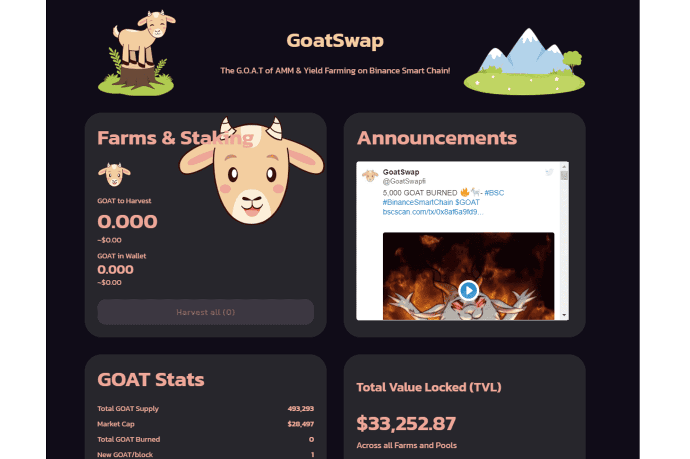

# GoatSwap

山羊交换
(GOAT) 是币安智能链上的 AMM & Yield Farming 平台。 GoatSwap 由一个专门的团队构建，旨在在 BSC 上创建 G.O.A.T AMM & Yield Farm。 $山羊是我们平台的本地令牌。在山羊队伍上桩，游泳池，交换和赚取$山羊。我们是币安智能链上的首选收益农场，具有许多其他功能。
与任何单产农场一样，其目的是制造通货紧缩，我们实施了混合燃烧机制，确保定期燃烧 GOAT。
混合燃烧机制
混合燃烧机制将通过利用“存款费用”和“GOAT 费用”来确保定期燃烧 GOAT。
“押金”——所有非山羊农场和矿池将收取 2% 的押金，90% 的押金将用于回购和烧掉 GOAT，10% 的押金将用于开发和营销.
“GOAT Fees”——通过 GOAT Fees 收集的所有 GOAT 将被烧毁。
山羊排放率‌
1山羊/块；
28,800山羊/天；
9.09% 将被发送到开发者的地址，所有这些都将被烧毁。
安全：
Timelock添加到MasterChef合同（24小时延迟）
删除了迁移器代码（摘自PancakesWap）。

