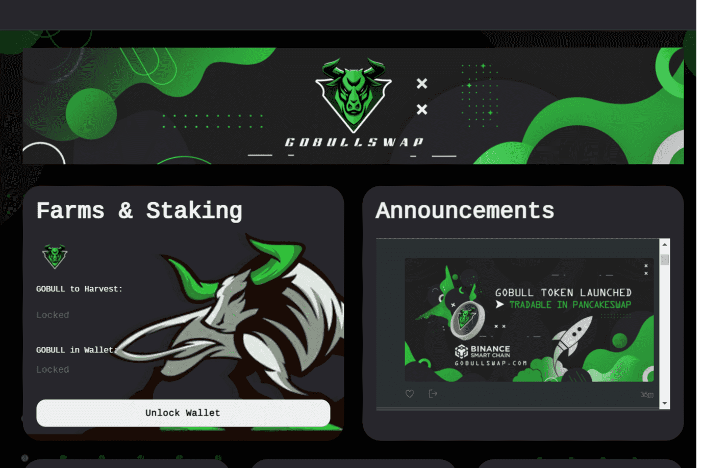

# GoBull Swap

GoBullSwap - Yield Farming 概念 通过 GoBullSwap 上的 Yield Farming，用户可以利用将他们的加密货币置于赌注中赚取高额利息。 根据 DeFi 分析和排名平台 DeFiPulse 的数据，DeFi 协议在这些程序中锁定了价值超过 500 亿美元的加密货币。 信息 代币名称：GOBULL TOKEN 代币符号：GOBULL 合约地址：0x58AAB456B36c1724c6eC9fE8403D4a1C3cb39C87Chain：Binance Smart Chain (BEP20) Transfer Tax - NO / Harvest Lock - NO Emission Rate 初始排放率：0.05 GoBull / Block 最低排放率：0.01 GoBull / Block Emission reduction ：每 9,600 个区块（约 12 小时），排放率将降低 3%

