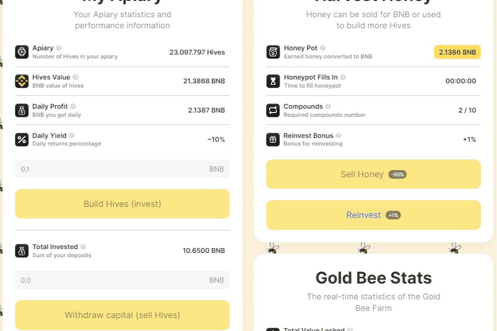

# GoldBee

GoldBee 是一个 GameFi 项目，任何参与者都可以从中赚取大量投资。
主要目标是在您的养蜂场中建立更多的蜂箱来生产蜂蜜，这些蜂蜜可以作为 BNB 提取。
我们的养蜂场将产生您初始投资的 8% 至 16% 的 BNB 收入。
您还可以通过与朋友分享您的个人链接获得 10% 的推荐奖励。您推荐投资的 10% BNB 将进入您的 Hives，并且该项目的另一个特殊功能使您可以提取（出售您的 Hives 的一部分），但前提是您从推荐。还有更多，当您从推荐中达到> 0,50 BNB（或更多）时，您还可以从您的总投资中取回相同金额。例如，您投资了 2 BNB，您从推荐中获得了 0,80 BNB，您可以提取 1,60 BNB，您的 Hives 价值将为 1,2 BNB (2 + 0,80 - 1,60)。但请记住，每 24 小时您必须复合（再投资）或出售您的蜂蜜，因为 24 小时后蜜蜂停止生产蜂蜜。这是为了确保每个参与者都处于活跃状态并保持平台活跃。
对于普通用户来说，这似乎并不复杂。但实际上，项目代码并没有那么简单。所有投资和取款均需支付 7% 的费用。这些资金被该平台的创建者积极使用，并明智地投资，然后在合同中作为 TVL 返还。这将确保项目的寿命，因为这将有助于增加合约的余额，即使没有更多新用户到来。当然，我们的目标是吸引越来越多的用户，但从长远来看，如果我们共同努力，我们可以为每个人保持稳定的收入。

