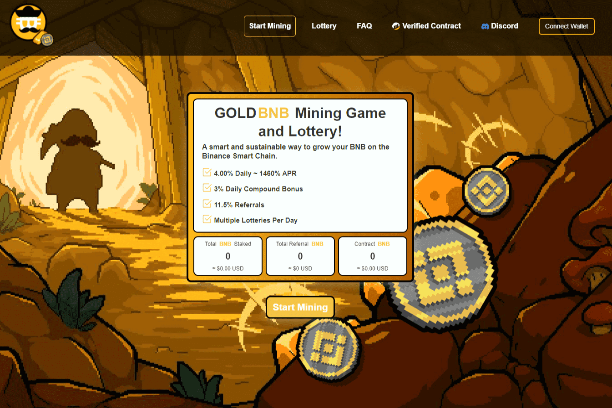

# GOLDBNB Mining Game

GOLDBNB 挖矿游戏是一个基于币安智能链的去中心化应用程序（DAPP），平均每天向您支付 8% 的 BNB 存款到 GOLDBNBMINE 合约中。每日 ROI 百分比取决于用户在平台内采取的影响 Worker 效率的操作。挖矿效率随着用户雇佣矿工、复合收益和口袋 BNB 奖励而上升和下降。 GOLDBNB 挖矿游戏：约 4% 的每日利息合约基础。 ~ 11,5% 推荐奖金。 ~ 0.005 BNB 最低投资。 ~ 截止时间 48 小时 ~ 提取冷却时间 4 小时 社区彩票：~ 每笔存款或复合的 1% 将被放入彩池中。 ~ 金额不会扣给用户，将是奖金。 ~ 抽奖将每 4 小时或 100 名参与者运行一次。 ~ 每个用户最多 50 张门票。 0.25 BNB = 50 张门票。 ~ 0.005 bnb = 每张票 1。基于用户存款/复合。 ~ 90% 的底池将分配给中奖地址。鲸鱼控制功能：~ 48 小时截止时间。 ~ 6 小时撤回冷却时间。

