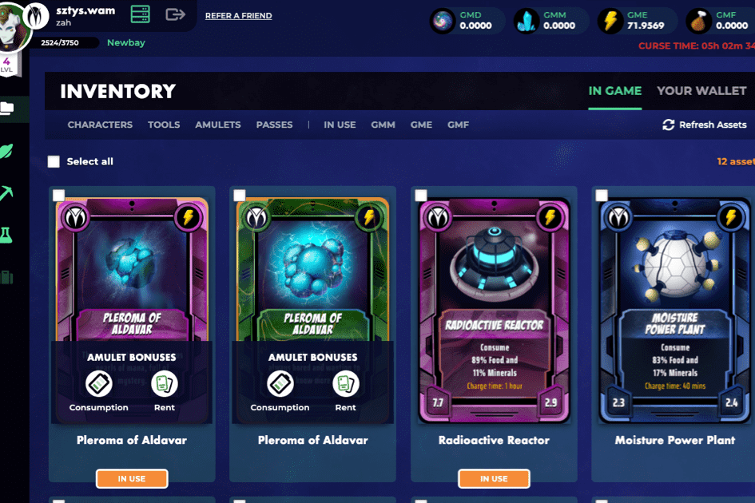

# Goldmand

游戏
这一年是2079年......过度开发地球的结果已经有发言权 - 自然灾害已经摧毁了90％的人类，以及许多动植物物种。在这个艰难的时刻，地球上的人类和生命的拯救被一个超级智能的外星物种 - 创造者拯救了。人们接受特殊的技术，使他们能够生存。特殊的仿生服装。令他们惊讶的是他们必须为生存付出的代价。他们必须生产食物来换取他们重要的矿物质和能量来换取服装。在他们的星球上不可用的资源。
与此同时，在宇宙的另一端，一个名为 Treon 的星球上生活着另一个种族——Alvins，一个高科技种族。他们的力量来自他们从巨大的Maalik树中获得的能量。为了寻找更大的能源，他们建造了一个等离子反应器。然而，当它推出时，发生了意外。它的辐射杀死了地球上所有的植物。因此，他们没有食物，这迫使他们寻求帮助并从创造者那里获得帮助。他们签署了一份合同，以交换他们生产的能源和获得技术所需的食物。反应堆的另一个大问题是它需要晶体才能稳定工作。创作者们也提供了急需的水晶……

