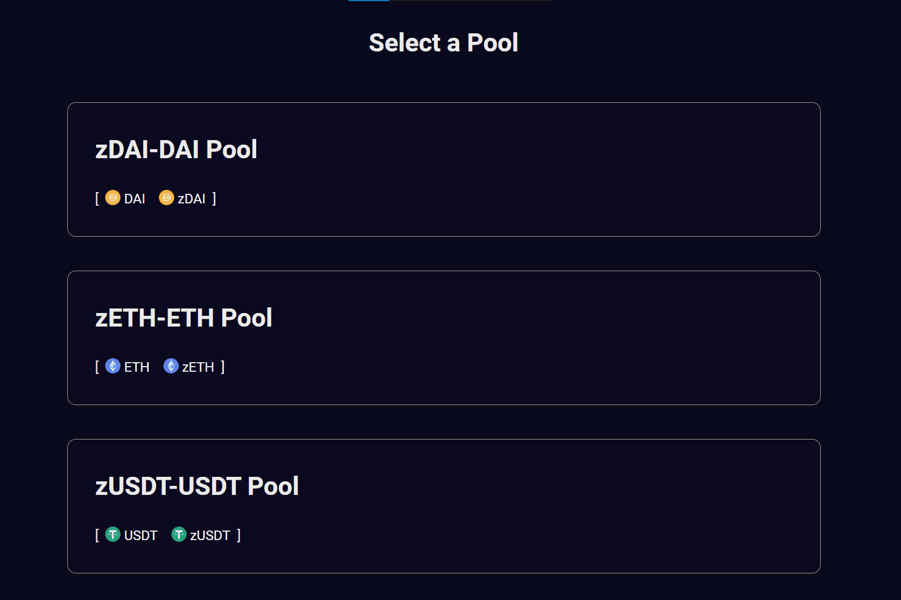

# Gondola Finance

Gondola 是 Saddle 的一个分支，但受到 Avalanche 的高吞吐量和亚秒级终结性的支持。 利用 StableSwap 算法，我们将连接 Avalanche 上的任何资产，以解决由于多个桥梁造成的碎片化流动性问题。60 $AVAX 已用于 $GDL 回购，作为对 $xGDL 持有者的奖励。 当前的 $xGDL 比率已达到 1.43，价值 200 个 $AVAX 的 $GDL 将被添加到 $xGDL 池中，直到星期五。 敬请关注 ！100 $AVAX 已用于 $xGDL 池的 $GDL 回购！ 2M $GDL 已存入 $xGDL 池，$xGDL 比率已达到 1,32！ 请继续关注本周接下来的 100 美元 AVAX 回购！

