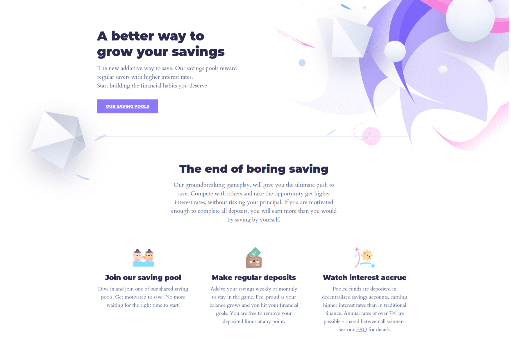

# GoodGhosting

GoodGhosting 团队相信储蓄是有益的、简单而有趣的世界。然而，传统储蓄并非如此。
我们构建去中心化的社会储蓄应用程序，帮助我们的社区养成更好的财务习惯，同时享受乐趣。对于我们的第一个产品，我们将游戏设计元素应用到基于目标的储蓄环境中。这种游戏化的方法奖励达到设定目标的专职存款人比没有达到设定目标的用户更多，因此给他们最终的推动力来达到他们的储蓄目标。奖励是使用现有的去中心化金融 (DeFi) 平台（例如 Moola、Aave 或 Curve）以非托管方式产生的，允许用户完全控制他们的存款。您可以将 GoodGhosting 视为建立在区块链技术之上的社交无损储蓄游戏。
我们于 2021 年夏季在 Polygon 上推出了首个 DeFi 储蓄池，随后于 2021 年秋季在 Celo 上推出。在撰写本文时（3 月 3 日），我们已帮助超过 26,000 名用户节省了超过 160 万美元跨两个区块链的资产价值。同时收集一些不错的 NFT 并爬上我们的排行榜。
我们的最终目标是提供基础设施来帮助构建您自己的基于目标的储蓄游戏，以便与家人和朋友一起玩，以及加入世界各地其他人创建的游戏。所有这些都是在将用户安全、可访问性和去中心化作为首要任务的同时实现的。向 DeFi 和游戏化的魔力带来的性感储蓄问好！

