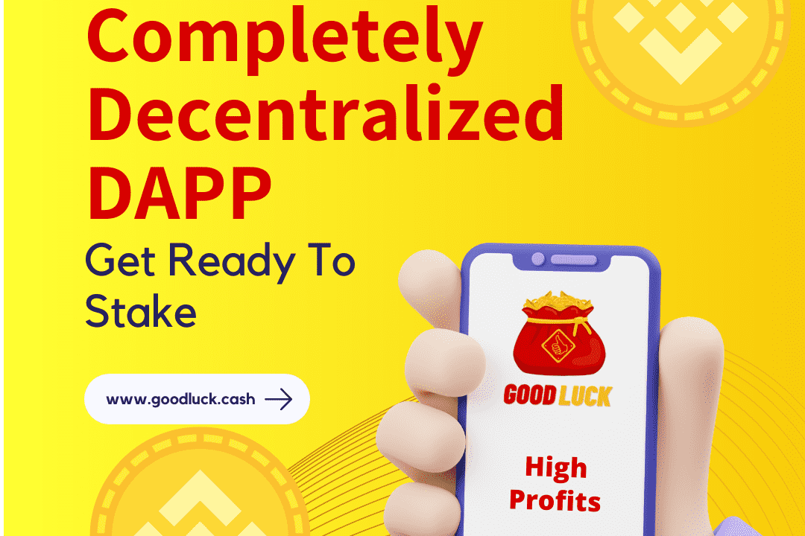

# GoodLuck Cash

祝你好运。 cash 是建立在币安智能链网络上的去中心化金融。本合约是为有长远眼光入池并获得稳定回报的投资者而设计的。该智能合约基于 TVL“锁定总价值”的概念，即进入矿池的用户将根据现有余额或合约中锁定的总价值获得奖励。
进入合约的用户必须购买运气，这将为您提供高达 3.6% 的每日回报和 1314% 的 APR 和奖励，这将完全取决于 TVL 和进入池的社区。您可以随时欢迎您回来或很快见到您的好运和您钱包中积累的 BNB。
很快见到你将直接降低合约的 TVL，从而间接降低你的运气。运气的价值也会不断波动，这会使 TVL 和您的运气随着时间的推移而波动。如果你欢迎更多的运气，它会增加TVL，直接增加你的运气。

