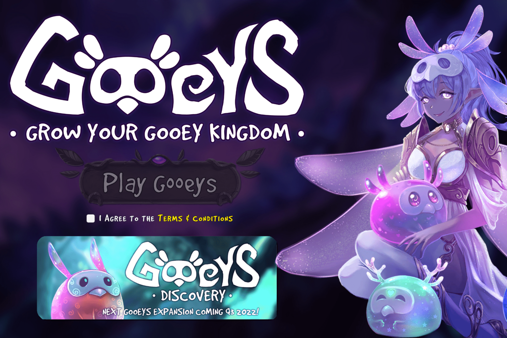

# Gooeys

Gooeys 是 Dogira Studios 团队的一款 Play-To-Earn 游戏，具有完全代币化的经济——从游戏中的角色到任务奖励的所有内容都完全在链上，并且可以在 OpenSea 等流行平台上进行交易。 Gooeys 由 Chainlink VRF 保护，确保所有随机滚动（例如角色/NFT 生成和任务奖励）都在链上，并且可证明是公平的。今天在 Opensea 上领取您的 Gooey，他今天的实时 Gooey 价格为 0.000173 美元，24 小时交易量为 5,054.31 美元。 我们将 GOO 实时更新为美元价格。 Gooeys 在过去 24 小时内下跌了 5.65%。 当前 CoinMarketCap 排名为 #5406，实时市值不可用。 循环供应不可用，最大。 供应不可用。

