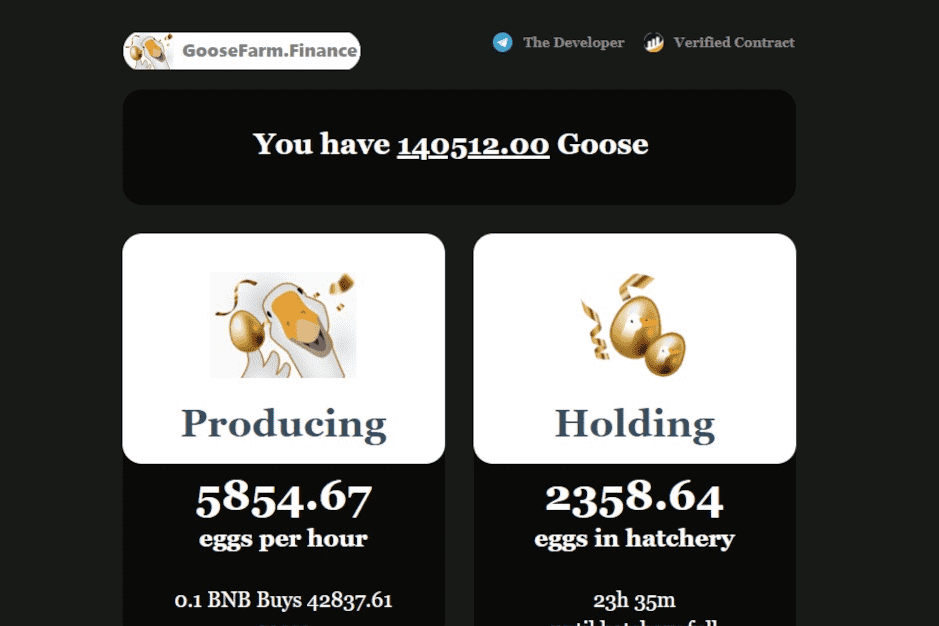

# Goose Farm Finance

养鹅赚BNB！
要玩，只需购买一些鹅。 鹅以每只鹅每天一个的速度产蛋。 例如：24 只鹅每天生产 24 个鸡蛋，或每小时 1 个。Goose Finance 已与 Fantom Chain 上的 Opera Swap 合作构建第二代 AMM。 代币持有者将能够通过质押获得掉期费用！我们仍在开发 AMM 版本。 由于安全是我们最关心的问题，我们仍在对其进行全面测试。 当前平台不存在 Flash Loan Exploit 的危险。我们正在继续开发新的 AMM。 随着我们发布的临近，我们会及时通知您！

