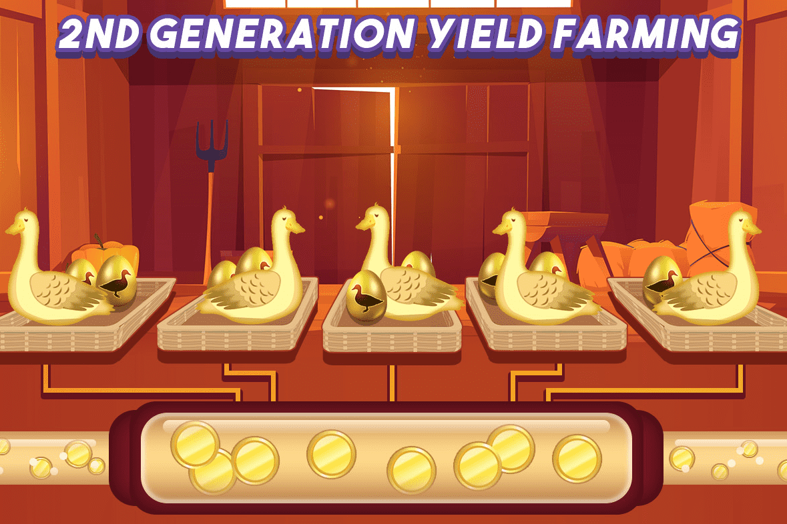

# Goose Finance

如果您熟悉 BSC 单产农业，那么您一定听说过著名的食品农场，例如 Pancake、Kebab，甚至是地毯拉爆米花交换。所有这些平台都没有像燃烧机制和时间锁这样的适当系统启动，并希望人们跳入池中。我们正在将其提升到一个新的水平。我们现在提出第二代收益耕种机制，该机制允许永久价格上涨，具有可持续和有利可图的耕作收益，并在发布时签订时间锁定合约！
我们试图解决的问题：

  大资金进出造成较大波动。
  使用稳定币持续创建代币，无需任何贡献
  令牌烧毁不足
  拉格拉

1) 独特的燃烧机制

  当您质押时，所有农场都会收取 4% 的燃烧费。
  3%将用于购买Golden Egg Token并注入彩票池。

2) 欧米茄大型彩票池

  由于 3% 的赌注将用于抽奖，因此抽奖池将非常巨大，您可以在赢得一等奖后退休。
  20% 的罐子将被烧掉，以进一步减少代币流通。

3) 价格持续上涨！！

  3% 的销毁费将用于从各个流动性池中购买金蛋。
  例如：如果人们质押 BUSD-BNB LP，3% 的 LP 代币将用于从各个金蛋池中购买金蛋。

4) RUGPULL 怎么样？
· 移除迁移者代码（继承自 Pancake swap）

  时间锁已在发布时应用！ （发射时 6 小时，1 周后 12 小时）

