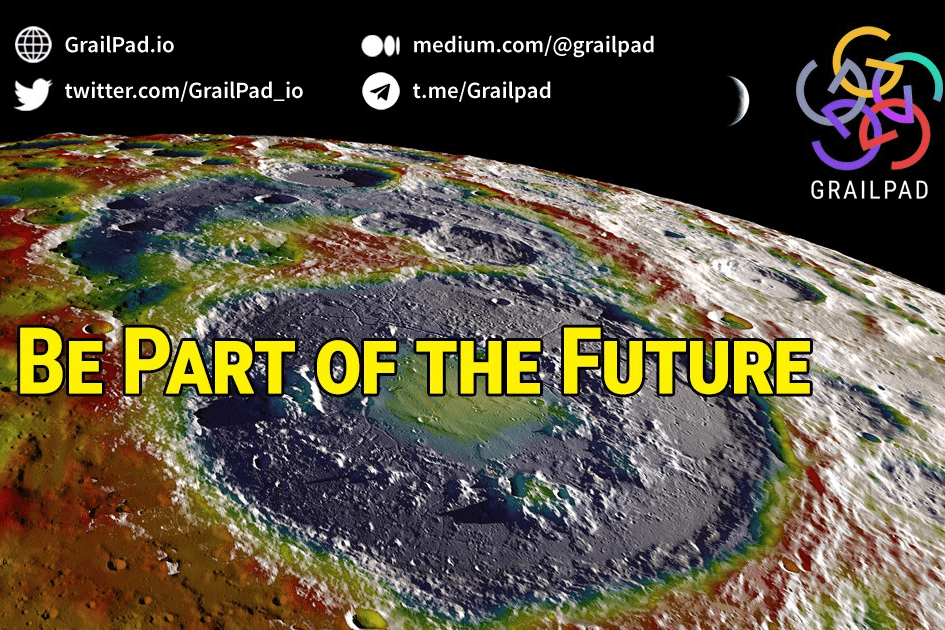

# GrailPad

GrailPad 是一种无需许可的 DEX，专为跨链代币池和拍卖而构建，使项目能够在基于自身生态系统的去中心化和可互操作环境中筹集资金。 借助 GrailPad，去中心化项目将能够廉价而快速地筹集和交换资金。 用户将能够参与安全且合规的环境，并使用通过我们在 BSC、Polygon、Solana、Etherium 和 Avalanche 中的门户网站的资产。GrailPad 授权 Launchpad 项目以通过事务和去中心化的方式提高流动性，在汇总中质押和发送代币

