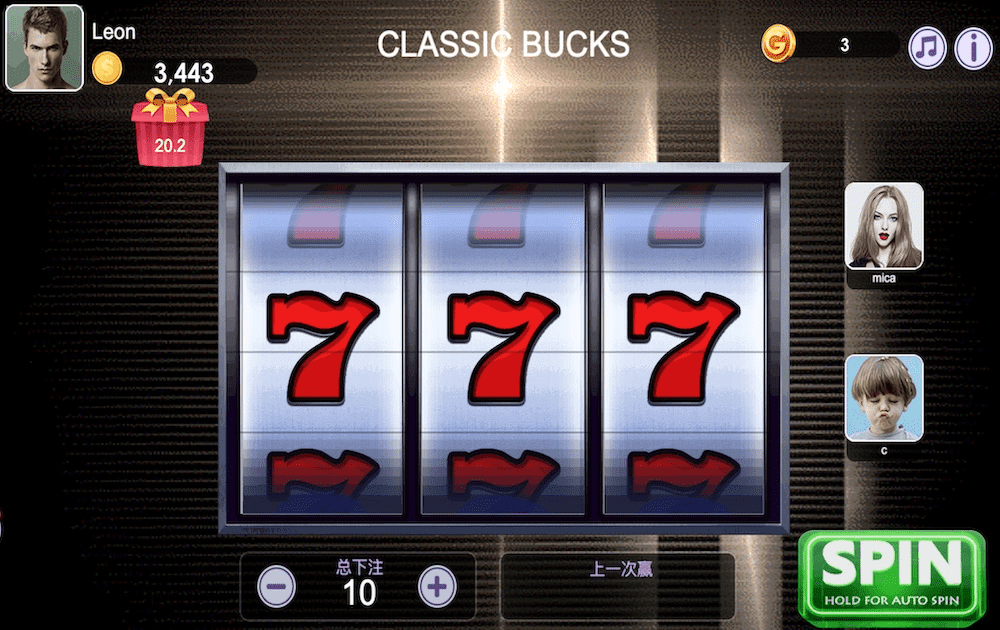

# Grand Casino

第一个拥有智能合约老虎机的社区拥有的赌场。 智能合约保证的支付是 0.95。 玩家可以通过挖矿GCT(Grand Casino Token)成为赌场的主人，永远获得分红。Grand Casinos (NYSE: GND) 是一家赌场运营商，由扑克玩家 Lyle Berman 和 Famous Dave's BBQ Restaurants 的创始人 Dave Anderson 共同创立，于 1990 年开始在明尼苏达州管理多家赌场。该公司在被希尔顿酒店收购后不复存在，然后于 1998 年将其与其他博彩资产合并形成 Park Place Entertainment。大赌场在 1995 年共拥有 8 家赌场。

