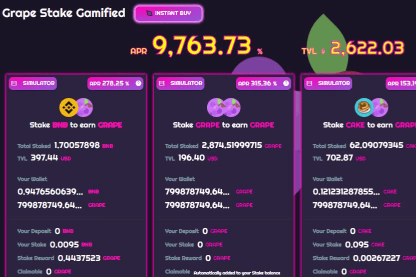

# GrapeSwap

Grapeswap 钱包的主要目的是成为所有葡萄工具生态系统的简单基础设施，并促进和扩大用户的采用。 鼓励市场维持这种挂钩，以便协议不会启动旨在保护挂钩的程序化机制。 如果出现 VAI 或其他合成稳定币失去其挂钩价值的点，协议可以使用治理过程来启动价格调整模块。GrapeSwap (GRAPE) - 强大的 DeFi 收益农业、质押、加电增益、奖励和代币效用生态系统多链。 GrapeSwap 的主要功能

   买
   质押
   农业
   代币拍卖
   奖励
   增加流动性
   交换
   多链

   平衡计分卡
   雪崩
   多边形
   幻影
   订单簿
   体育博彩
   玩赢得 Grapenopoly
   社区 DAO

更多来...

