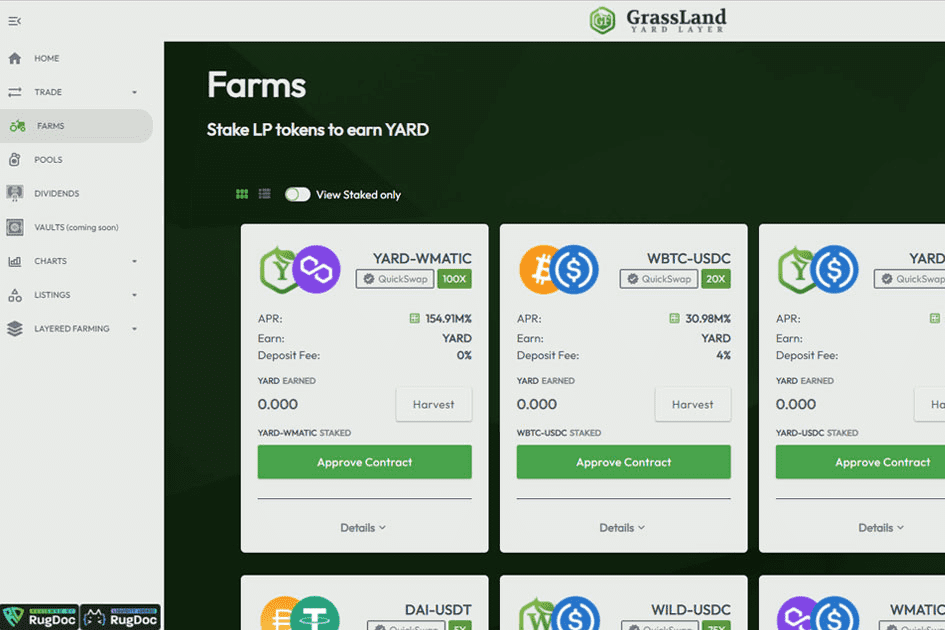

# GrassLand Finance

$WILD 和 $YARD 功能
GrassLand Finance 是 Polygon 网络上的一种渐进式分层收益农业协议，最终旨在引入创造性功能（如燃烧金库和委托农业系统），使过去的层保持相关性，而不仅仅是用于耕种未来的层。
我们的乘数设置方式使得提供流动性受到高度激励。
此外，未来的层有望从“委托农业”机制中获利，以帮助维持原生代币价格。
对于无常损失 (IL) 风险厌恶的用户，除了成熟的蓝筹加密货币和稳定币外，还可以使用单一权益池。
由于大多数分层项目原生的代币供应有限，主要的需求激励系统将围绕现金流支付（又称股息），而在回购方面将采取更具选择性的方法，以防止它们成为浪费平台收入。
WILD 和 YARD 持有者将能够将他们的代币用于各种蓝筹和合作项目，代币等。
我们还为我们之前的层代币引入了燃烧金库，这样它们的底价就一直在上涨。

