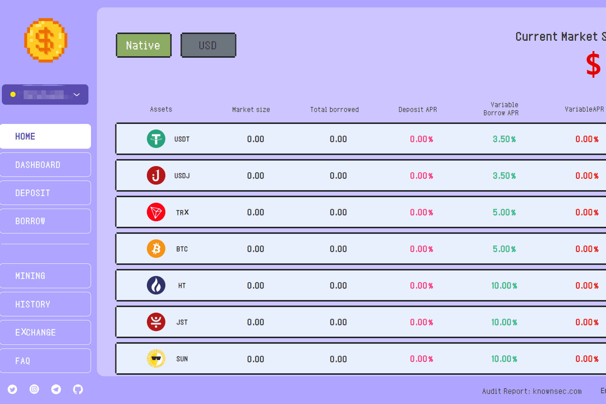

# GRB - TRON Lending

糯米饭团是一个开放的 Defi 协议，用于加密存款和借贷服务。获取最重要的 GRB - TRON Lending dApp 指标触手可及 - 分析下面的深度图表，评估 dApp 在不同时间段的活动并做出快速、准确的决策！GRB - TRON Lending dApp 是基于 Tron 协议构建的 DeFi 类别的加密资产。 现在，根据用户数，它在一般 dApp 排名中排名第 2330 位，在 DeFi 类别中排名第 826 位，这让您可以很好地了解 GRB - TRON Lending dApp 在其竞争对手中的表现。

通过分析最近 30 天窗口中的 GRB-TRON Lending dApp 数据，很明显 dApp 的余额为 183.23 美元，交易量稳定在 0.00 美元。 GRB - TRON Lending 在 30 天内产生了 0 笔交易，变化为 0%。 显然，与之前的 7 天相比，成交量稳定了 0%。 最近7天的数据显示，GRB-TRON Lending用户基数为0，稳定了0%。

我们还建议查看 GRB - TRON 借贷活动概览和智能合约余额图表，了解这些重要指标如何随时间波动和变化。

