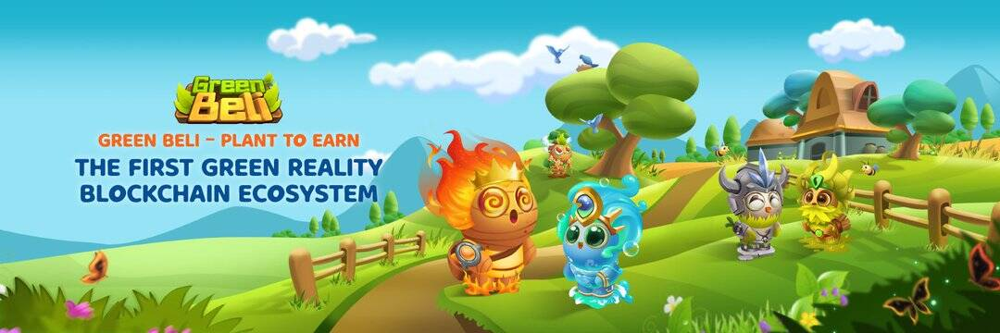

# GreenBeli

我们于 2019 年启动了 Green Beli，作为支持生态活动和提高环境意识的传统项目。 我们还为热爱环境的社区建立了一个名为“绿色地图”的环保地点网络。
凭借团队的专业知识和弥合区块链与现实世界之间差距的强烈愿望，我们决定将 Green Beli 构建为第一个绿色现实区块链生态系统，包括 (1) Green Beli Play & Earn NFT Game； (2) 具有 Plant2Earn 概念的绿色元宇宙； （3）绿贝利环保基金（GEPF）。
我们 Green Beli 是绿色地球的热情信徒。 出于这个原因，Green Beli 生态系统的灵感来自我们对环境意识和可持续性的概念。 参与 Green Beli 生态系统，您不仅可以获利，还可以为支持有利于环境的活动做出贡献。

