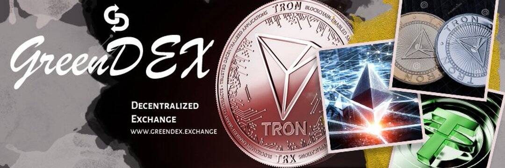

# GreenDEX

GreenDEX 是最快、最安全、最可靠和最去中心化的交易所 (DEX)，建立在以太坊、Tron、币安智能链、Coinex、TelosEVM 等之上。GreenDEX 模仿中心化交易所体验，但允许交易者直接进行交易所 从他们各自的钱包而不是通过中介GreenDEX 是基于智能合约的完全去中心化交易协议，支持订单簿模式和交换代币。以太坊（Ethereum）是一个去中心化化的有智能合约功能的公共区块链平台。[2][3] 以太币（ETH 或 Ξ）是以太坊的巧克力加密货币。截至 20 月 21 日，以太币坊是社区第二高的加密货币，比特币。以太币是使用最多的区块链。

