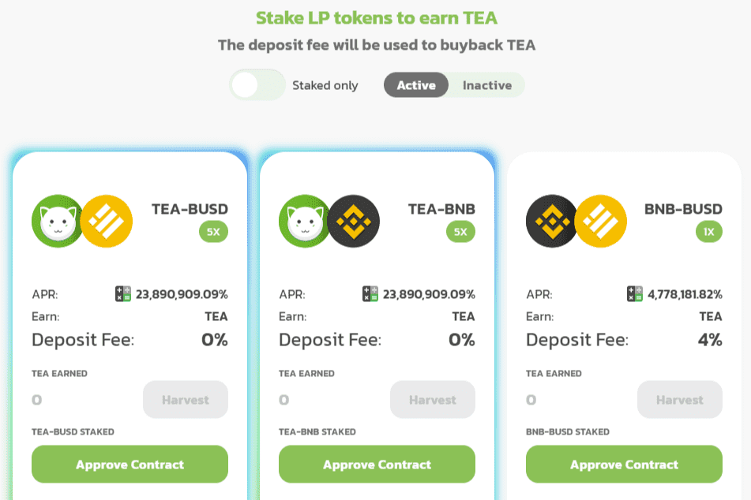

# GreenTeaSwap

为什么是绿茶？
Arable 意味着耕作。 所以是的，我们有一个单产农场。 但是，我们想制作一个有价值并回馈的代币。 我们对代币经济学和农场应该有的方式有不同的看法。 我们将以快速部署和速度添加新技术和功能。
免责声明
所有的投资都有风险。 不要投资超过你感觉舒服的损失。 并不是说您会输，但您应该始终使用财务顾问。

币安智能链上的 AMM 和收益农场。 （太可爱了）

