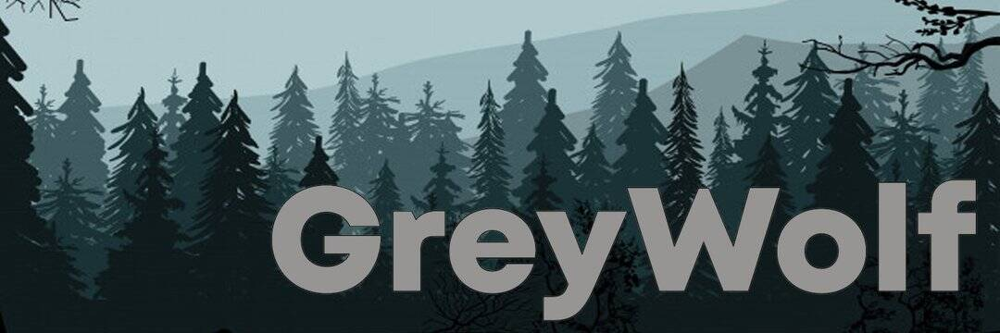

# Grey Wolf

Greywolf 的基本概念与许多其他 DeFi 项目相似：这是一个完全去中心化的平台（去中心化（英文：decentralization）是互联网发展过程中形成的社会关系形态和产出形态，是相对于“中心化”而言的新型网络内容生产过程。相对于早期的互联网（Web 1.0）时代，Web 2.0 不再是由专业的网站或特定的内容在人群中产生，而是由全体网络参与、平等的共同创造的结果。任何人都可以在网络上表达自己的或创造原创的内容，共同创作观点。），用户可以在其中从事收益耕作或作为流动性提供者赚钱，以及访问加密货币交易所和 NFT 市场。 但是，我们对协议进行了重大更改，以鼓励用户之间的合作，并使每个“包成员”的个人贡献不仅增加了他们的收入，而且增加了平台上所有用户的收入。

