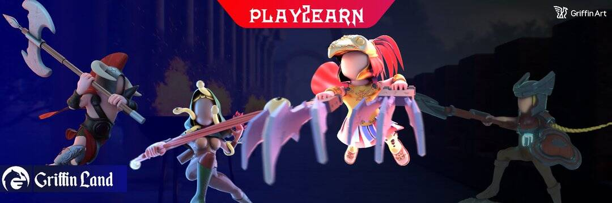

# Griffin Art

GriffinArt 是下一代、去中心化和最新的主要 NFT 市场和 GameFi 项目（围绕神话生物），由透明、强大、可靠和超通缩令牌提供支持：$GART
在格里芬艺术平台上，我们正在为各种不同类型的才华横溢的艺术家建立一个通用的基础，他们可以展示自己的才华，从而弥合主流和小众数字艺术家之间的差距。为此，我们为我们的用户（创作者、收藏家、交易者）提供了一个时尚、简单的用户界面、最先进的、去中心化的、以创作者为中心的、具有成本效益的、支持 De-Fi 的、支持维度的和一个通用的市场。
我们的市场进入策略包括为 Griffin Art 社区推出一个允许 NFT 生成和治理令牌 ($GART) 的 NFT 市场。 Griffin Art 是一个包罗万象的 NFT 市场，利用币安智能链的潜力实现可访问性、NFT 共享、创建和所有权。
（游戏（Griffin Land）的详细信息将很快公布。）
$GART 特点：
它有一个回购功能，可以自动获取所有交易的 %7，用该金额进行回购并烧掉它获得的所有代币。因此，不会有连续两次卖出，每次卖出后，董事会都会有一次买入。流通供应总是随着价格上涨而减少。机器人也不能滥用这种回购机制，该功能的某些部分已升级以使其无懈可击。
它有一个再分配功能，将所有交易的 %2 代币金额按比例分配给持有者。因此，持有者拥有的代币数量总是随着每笔交易而增加。
还有 %2 的营销费。

