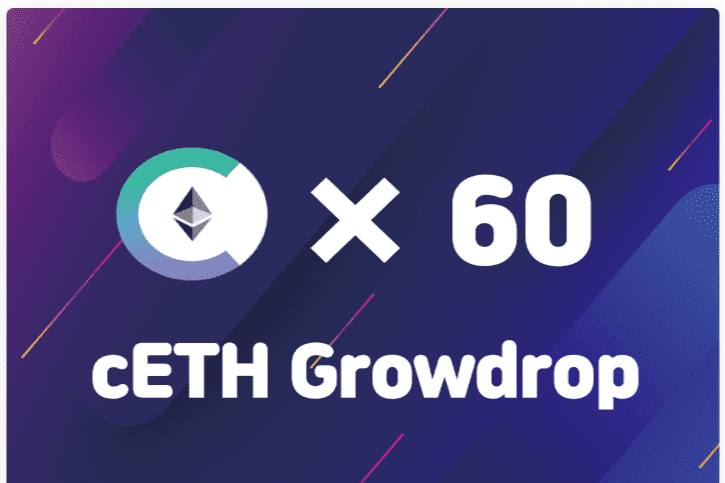

# Growdrop

Growdrop 是一种无损融资解决方案，可最大限度地降低现有第三方的信任成本，将投资资金存入 DeFi Lending Protocol 的流动资金池，为开源项目贡献利息并确保投资者本金。 如果初始代币项目没有上架或没有使用，可以将来自 Growdrop 的代币上传到 uniswap 设置上架和价格。 您可以对分配到 Growdrop 池的人进行一定数量的代币和利息的“uniswap creat exchange”。 该项目将慢慢建立社区，以帮助促进公共关系和技术发展。 在这里，在早期的以太坊社区中，它在本质上与 DAICO 非常相似。

