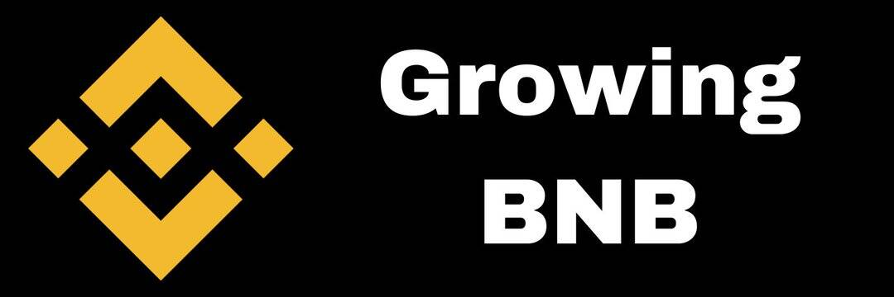

# Growing BNB

GrowingBNB 是一种币安智能链协议，可在 7 至 30 天内为您的 BNB 投资提供高达 300% 的利润。
什么是GrowingBNB？
不断增长的 BNB 是币安智能链收益农业协议交易量增加和 BNB 链的增长提振了预测，但代币现在在哪里？币安币 (BNB) 自 2017 年夏季推出以来已经走过了漫长的道路。该币是专门为币安生态系统开发和设计的，提供回扣以激励其使用。 所有硬币都是在首次发行硬币之前预先开采的，价格定为每 BNB 0.10 美元。

尽管 2018 年是加密货币冬天，但 BNB 在山寨币市场已被证明具有弹性——并且快进到 2022 年，币安币的价格仍然引起了很大的兴趣。 根据 Arcane Research 的数据，该代币在 2021 年上涨了大约 1,344%，而比特币上涨了 73%，以太坊上涨了 455%。

BNB 需求随着加密货币价格的急剧上涨而增长。 在 2021 年期间，BNB 从 1 月份的 38 美元左右上涨至 5 月初的历史高点 683.82 美元，并在 11 月初创下了 668.07 美元的新高。

