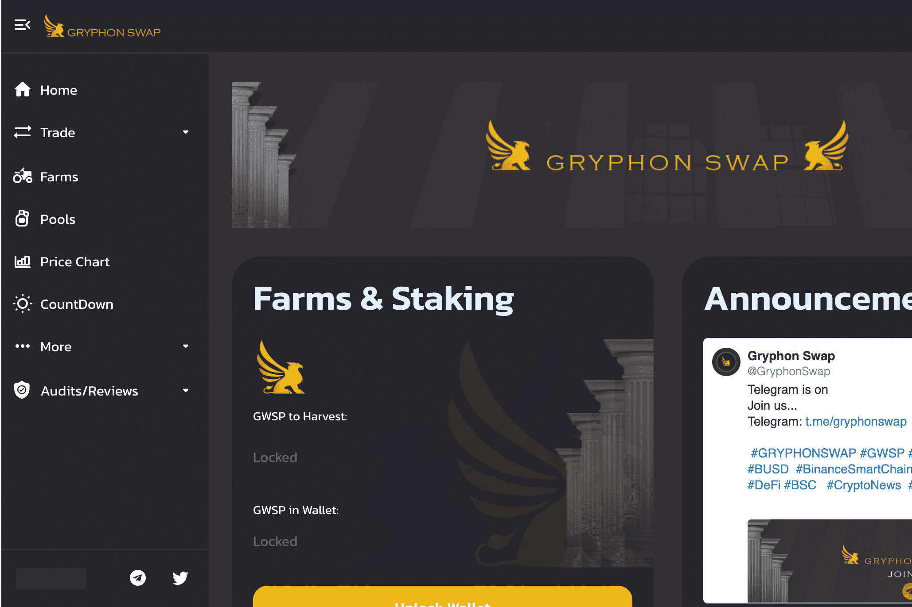

# Gryphon Swap

Gryphon Swap 是一个全新的 DeFi 项目，由经验丰富的开发团队设计，作为 BSC 上的第三代通缩游戏化收益农场和 AMM。
除了 Goose Finance 引入的回购销毁机制。
以下是一些已经实现的亮点功能：

- 启动时添加时间锁
- 移除了迁移代码
与其他通缩单产农场不同，我们不打算在推出后发展分层农业。 因为我们认为通过分层耕作继续发行新代币没有多大意义。

