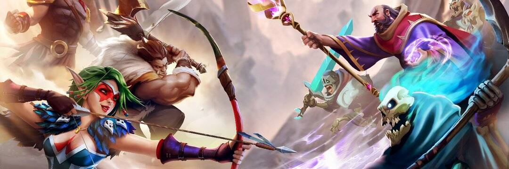

# Guild of Guardians

Guild Of Guardians 是一款移动角色扮演游戏，允许玩家将他们的游戏热情转化为资产。 这将是一款多人、奇幻、动作角色扮演游戏，玩家可以在其中建立自己的“守护者”梦之队，并在公会中竞争以获得史诗般的奖励。 Guild of Guardians 由 Stepico 开发并由 Immutable 发布。 Stepico Games 是乌克兰领先的游戏开发工作室，拥有 80 多名设计师、艺术家和开发人员组成的团队。 他们在策略和角色扮演领域开发了多款手机游戏，下载量已超过 500 万次。 Immutable 是一家行业领先的 1700 万美元风险投资资助的区块链公司，由 Naspers、Galaxy Digital 和 Coinbase 等投资者支持。 他们负责推出最成功的区块链交易卡牌游戏 Gods Unchained，该游戏由 Magic the Gathering Arena 的前总监 Chris Clay 领导。

