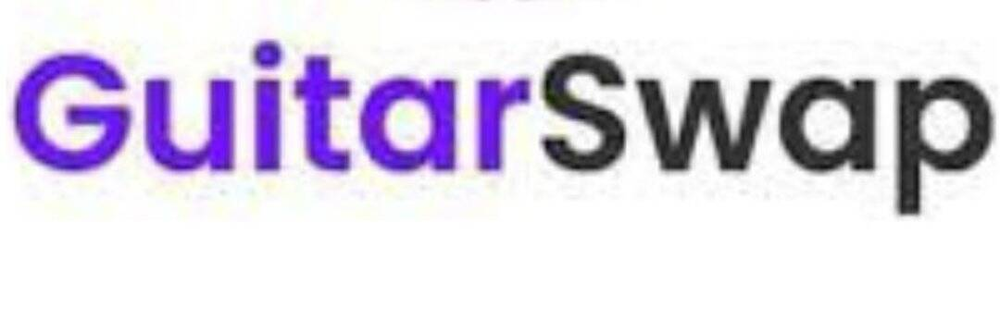

# Guitarswap

GuitarSwap - 币安（201年初8以来，币安在交易方面被认为是交易量最大的加密货币交易所。币安“Binance”的基础单字组合。 币安和一个加密货币的 14 14 加密交易可以在 200 年 2 月 17 日 10 万个加密货币服务开始的交易，包括英国的加密货币如比特币、以太坊加密货币交易。 、莱特币以及它自己的BNB代币。 智能链（BSC）上最好的 AMM DEX，BSC上最受欢迎的AMM！ 通过收益耕作赚取吉他，或者将其投入糖浆池以赚取更多代币！ 初始农场产品（由 GuitarSwap 开创的新代币发行模式）

GuitarSwap - Binance Smart Chain (BSC) 上最好的 AMM DEX BSC 上最受欢迎的 AMM！ 通过收益农场赚取吉他

